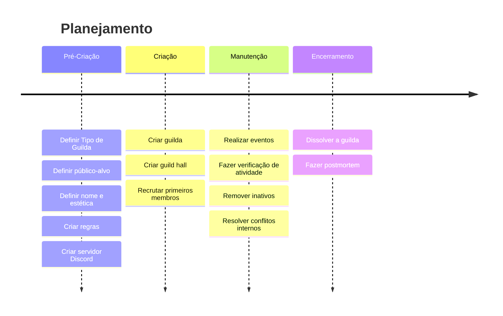

---
authors:
  - pen
date: 2025-04-13
keywords:
  - aqw como criar uma guilda
  - aqw best aqw guild
  - aqw how to create a guild
  - aqw guilds
  - aqw guild hall
  - aqw ultrahub
  - aqw guild spotlight
description: Como planejar, criar e manter uma guilda no AQWorlds. Um guia através da ótica de um líder de guilda.
social_share: true
---
# Guildas
---
!!! tip "Dica"
    Veja os links à esquerda da página ou clique em :fontawesome-solid-bars: (canto superior esquerdo).
## Introdução
E aí, pessoal! Aqui é o Pen. Neste tutorial, vou trazer para vocês como criar uma guilda no Adventure Quest Worlds.
## Planejamento Inicial


### Por que criar uma guilda?
Se você está criando uma guilda, algum motivo você deve ter, seja ele para ter amigos para poder jogar junto dentro do jogo, ou para lutar contra outras guildas em duelos 1v1 de classe primária, ou mesmo porque saiu de uma guilda para fundar outra porque não concordava com a visão da liderança.

### Tipo de Guilda
Trago pelo menos **3 tipos** de guildas. Não significa que você precise escolher só um foco, pois o que faz a guilda é o jogador que você recruta, então sempre vai ser uma distribuição sobre o que mais sua guilda se aproxima.

=== "Social"
	 É um tipo de guilda com baixos requisitos para entrada e geralmente os jogadores estão nela para conversar entre si, como é o caso de muitas guildas que centralizam-se em Yulgar, BattleonTown e outros locais populosos.	

===+ "PvP"
	Neste tipo de guilda, os jogadores tem foco maior em *Player vs Player*. Era muito comum em 2015, onde posso citar nomes como Brawl, Olympus, Infernal Angels, Dark Angels e outras.
    
===+ "EndGame"
    São guildas que possuem jogadores focados no endgame do jogo, que estão fazendo ultra bosses ou farmando os itens mais complexos do jogo.

??? info "Gráfico de distribuição"
    ```mermaid
    pie title Distribuiçao de Membros
            "Social" : 50
            "PvP" : 10
            "EndGame" : 30
    ```
### Público-alvo
Aqui você definirá o publico-alvo da sua guilda e serão, majoritariamente, representará seu clã em termos de números.

- Novatos
- Veteranos
- PvE
- PvP
  
### Nome e identidade da guilda (tema, estilo, estética)
- Escolha um nome de guilda memorável, de preferência curto. Evite utilizar sufixos como *angels*, *guardians*, pois existem inumeras guildas que possuem um nome quase identico.
- Selecione um tema para sua guilda. Pode ser uma cor (ciano), um estilo como legion ou nation, ou mesmo uma estética que pode ser moderna, cartoon.

???+ info "Guilda HollowInk"
    Em 06 de outubro de 2019, fundei uma guilda chamada **HollowInk**. Surgimos com a proposta de nos tornarmos um dos clãs mais organizados do Adventure Quest Worlds. Nós valorizamos o crescimento mútuo de nossos membros e propomos diversas atividades que tem o objetivo de mantê-los nesse jogo.
		
    A nossa estética girava em torno da cor **ciano**, cor essa que pode ser vista no nosso site https://hollowinkguild.wixsite.com/ e em fotos que tirávamos em grupo.
    


### Regras e diretrizes básicas
Defina as regras para o funcionamento básico da guilda. É importante ressaltar que usar os termos de serviços do jogo como base é a melhor opção.

???+ tip "Modelo de Regras"
	- É terminantemente proibido QUALQUER tipo de preconceito relacionado a raça, a sexualidade, a etnia, etc;
	- Não é permitido divulgar ou usar bots, launchers, trainers, macros, APKs ou qualquer outro programa de terceiros ilegal;
	- Não toleramos difamações de jogadores ou de guildas;
	- E o que consideramos mais importante: ajude a quem precisar, sejam eles da guilda ou não!

## Fundação da Guilda

### Requisitos
Só há dois requisitos para fundar uma guilda: ter **member** e **muita paciência**, afinal uma guilda além de diversão é comprometimento.

### Criando a guilda dentro do jogo
Dentro do jogo, pressione <kbd>ENTER</kbd> para acessar o campo de chat e digite `/gc [NOME DA SUA GUILDA]`. Feito isso, caso o nome selecionado não exista, você será capaz de ver o nome da recém criada guilda  abaixo do nome do seu usuário.

### Comandos de Guilda

| Comando | Ação |
|--------|------|
| `/gc` `nome` | Cria uma guilda |
| `/gd` `[jogador]` | Rebaixa jogador da guilda |
| `/gi` `[jogador]` | Convida para guilda |
| `/gp` `[jogador]` | Promove jogador |
| `/gr` `[jogador]` | Remove da guilda |
| `/rg` `[jogador]` | Renomeia guilda (Custo: 1.000 AC) |
| `/g` | Ativa o chat da guilda |
| `/guild` | Abre interface da guilda |
| `/motd` | Exibe mensagem do dia |
| `/motd` `mensagem` | Define mensagem do dia |


### Criando um Guild Hall
Esta parte é opcional, mas altamente recomendada. O guild hall será o lugar onde os membros do seu clã irão se reunir na maior parte do tempo.

No vídeo abaixo, eu mostro como criar.

<div style="position: relative; width: 100%; padding-bottom: 56.25%; height: 0; overflow: hidden;">
  <iframe 
    src="https://www.youtube.com/embed/BqoLHu2RacA?si=Q_Lxz7nA6-6glzhX" 
    title="YouTube video player" 
    frameborder="0" 
    allow="accelerometer; autoplay; clipboard-write; encrypted-media; gyroscope; picture-in-picture; web-share" 
    referrerpolicy="strict-origin-when-cross-origin" 
    allowfullscreen 
    style="position: absolute; top: 0; left: 0; width: 100%; height: 100%;"
  ></iframe>
</div>

Em resumo, crie uma conta com o mesmo nome da sua guilda (ou uma abreviação dele); Consiga ouro (ou outros recursos) suficientes para comprar uma casa em `/BuyHouse` e por fim divulgue para os seus membros ou amigos.
  
## Recrutamento e Integração

!!! note "Nota" 
    A partir daqui, o foco passa a ser menos sobre como criar uma guilda e mais sobre como estruturá-la e potencialmente mantê-la. Essas são recomendações extras, baseadas em experiências práticas, que você pode seguir conforme o rumo que sua guilda tomar.

O recrutador é o guardião da porta de entrada da guilda. Ele representa os valores da comunidade e é responsável por garantir que novos membros estejam alinhados com a cultura, regras e visão do clã. Seu trabalho não é apenas convidar — é filtrar, acolher e acompanhar.

### Onde Recrutar

Existem diversos lugares onde você pode recrutar seus membros:

- Dentro do jogo (em locais movimentados, como Battleon, Yulgar, salas de ultra bosses ou eventos)
- Fóruns oficiais e comunidades do jogo
- Redes sociais (Facebook, Discord, Reddit, etc.)
- Por meio da presença de servidor — uma guilda ativa e respeitada atrai interessados naturalmente

!!! danger "Poaching"
    Em hipótese alguma realize _poaching_, que é uma prática que consiste em falar mal de outra guilda para recrutar um membro dela para a sua. É deplorável chegar a este ponto para trazer alguém para o seu clã. Se está fazendo isso, repense.

O meu método favorito era ao encontrar jogadores precisando de ajuda ou que estavam ajudando alguém, eu chamava todos os membros que estavam online naquele momento para juntarem-se a mim para ajudar e logo em seguida todo mundo ia embora, ficando apenas a pergunta: o que acabou de acontecer? Não era necessário falar nada. Se aquilo é o que aquele jogador está procurando, ele acabou de ter um vislumbre sobre o que é fazer parte da minha guilda.

### Processo de Recrutamento

**Antes de qualquer convite:**

- Observe o comportamento do jogador no chat e durante interações em grupo
- Anote pontos positivos e negativos
- Verifique o histórico do jogador, se ele já foi banido de alguma guilda ou mesmo da sua caso já tenha criado a guilda

???- tip "Como banir efetivamente um jogador?"
     Banir um jogador não é algo que queremos fazer todo dia, mas é algo totalmente necessário para que problemas não ocorram na sua guilda. Para fazer isso é necessário registrar:
     
     - **Quem baniu:** Pen
     - **Quem foi banido:** Nome do Membro
     - **ID do Discord:** numeração única para cada perfil do Discord que pode ser obtida ao clicar com o botão direito do mouse em cima do perfil do usuário e depois em Copy User ID.
     - **ID da House:** essa numeração pode ser obtida ao olhar os números que ficam no lugar do nome do mapa ao ir para casa do jogador.
     - **Motivo:** Coloque o motivo plausível pelo qual o membro foi banido, como por exemplo uma violação das regras da guilda.

     Você pode registrar isso em um canal, em um bloco de notas ou em um formulário no Google Forms. 

**Durante o Recrutamento:**

1. Convide com bom humor. A primeira impressão é crucial!
2. Leve o jogador para a base da guilda como `/house hollowink` ou algum lugar reservado
3. Apresente a cultura e regras da guilda. Pergunte se ele se identifica e concorda com elas.
4. Ajude com o Discord (se necessário).
5. Tire um print com os membros e poste em nas redes sociais

???- tip "O que devo ter no meu formulário de recrutamento?"
     Um formulário de recrutamento é onde você conseguirá conhecer um pouco sobre o membro e o motivo pelo qual ele quer se juntar a sua guilda.

     Este é um exemplo redatado de um formulário preenchido da guilda HollowInk:

     - **Usuário:** nome de usuário dentro do jogo
     - **Nome (opcional):** nome do jogador 
     - **Celular (opcional)** número de celular
     - **Fale sobre você e porque quer se juntar a nós**: meu nome e {nome} tenho {idade} anos, jogo AQWorlds desde 2011 por um bom tempo permaneci bem ativo no jogo, porém em 2017 acabei dando uma parada por questões de trabalho e também acabei desanimando do jogo, retornei há 3 meses no aqw e estou gostando muito das atualizações... e hoje procuro uma guild para que eu possa fazer parte e acrecentar nela, ouvir fala da HOLLOWLNK e gostei muito do trabalho que vcs fazem .
     - **Se alguém te pede ajuda, o que você faz?** Esta pergunta aqui é para livrar a guilda dos jogadores _trolls_. É muito importante que um recrutamento seja levado a sério.

**Após o Recrutamento:**

- O novo membro entra em período de observação;
- Chame todos os membros da guilda para recebê-lo em jogo dentro da base;
- Incentive a participação e a ajuda mútua;
- Acompanhe o progresso e o comportamento

## Comunicação
A comunicação da guilda deverá ser feita de forma efetiva, pois é a partir dela que você irá manobrar os membros para eventos, para ultra bosses, ou qualquer outra coisa necessária dentro da guilda.

Você poderá fazê-la através de:

- Canais fora do jogo (Discord, WhatsApp, grupo no Facebook)    
- Boletins, eventos e reuniões

**Minha recomendação é o Discord**, um mensageiro que permite que o membro mantenha sua privacidade. Por mais que o whatsapp seja muito utilizado por várias pessoas, a concessão do número de celular é algo que pode colocar em risco os dados do membro e portanto deve ser tratado com cautela. Você poderá baixá-lo clicando no botão abaixo:

[Baixar o Discord](https://discord.com/download){ .md-button .md-button--primary }


## Atividades e Engajamento
É essencial que você mantenha seus membros ativos dentro da guilda para que sempre haja gente para conversar dentro do jogo.

- Eventos semanais ou mensais (farm, PvP, moda, quizzes, roleplay)
- Participação em eventos oficiais do AQW como guilda
- Desafios e metas internas
- Sistema de recompensas e reconhecimento (medalhas, cargos, destaques)

??? tip "Como criar um Desafio Semanal?"
    Criar desafios semanais é uma ótima forma de manter a guilda engajada e ativa. Siga os passos abaixo para criar um desafio claro, divertido e funcional.

    **1. Defina o objetivo**  
    Escolha uma atividade que envolva a comunidade. Pode ser algo dentro do jogo (como derrotar um chefe ou completar uma missão), algo criativo (como tirar a melhor captura de tela ou contar uma história), ou até colaborativo (como um evento em grupo).

    **2. Estabeleça a comprovação**  
    Indique claramente o que o participante deve enviar para validar a participação. Exemplo:  
    "Envie uma captura de tela mostrando a aba de missões completas com o nome da quest visível."  
    Quanto mais específico, menor a chance de dúvidas.

    **3. Escolha a dificuldade e o prazo**  
    A dificuldade define por quanto tempo o desafio ficará ativo:

    - Fácil: 1 semana  
    - Médio: 1 semana  
    - Difícil: 2 semanas  
    - Extremo: 1 mês

    **4. Escreva a postagem para o canal de #Desafios-Semanais**  
    Use um formato direto e padronizado. Um exemplo:

    

    - **Título:** 69° DESAFlO SEMANAL - Wall Awe Plaque
    - **Objetivo:** O desafio desta semana é obter a Wall Awe Plaque, um item house que serve de atalho para você acessar os encantamentos Awe.
    - **Comprovação:** Tire um print da sua casa com o item equipado.
    - **Prazo:** Até 20/04 às 23:59.
  
    **5. Valide as entradas**  
    Acompanhe o canal #「📥」Entradas. Quando um jogador participar corretamente, reaja com "OK" ou comente confirmando.  
    Caso a entrada não esteja conforme as instruções, explique o motivo educadamente para que a pessoa possa corrigir a tempo.

    Manter a clareza e o padrão nos desafios semanais ajuda a motivar a participação e fortalece a comunidade.

## Manutenção e Crescimento
- Como manter os membros ativos
- Reavaliar regras e cultura de tempos em tempos
- Expandir com alianças e colaborações com outras guildas
- Substituir membros inativos com cuidado e tato

## Legado e Sustentabilidade
- Preparar novos líderes (mentoria)
- Deixar um histórico da guilda (site, blog, arquivos no Discord)
- Manter viva a missão original, mesmo com mudança

## Considerações Finais
Além de um guia, este é uma forma de trazer um post-mortem da guilda HollowInk. Por anos, foi uma das maiores guildas do Brasil, contou com mais de 500 membros, uma _branch_, site, item dentro do jogo (obrigado Teka), desafios semanais e muitas outras coisas que passaria um tempo escrevendo.

## Referências Bibliográficas
- ANDREWS, Scott F. _The Guild Leader's Handbook: Strategies and Guidance from a Battle-Scarred MMO Veteran_. 1. ed. Austin: No Starch Press, 2010.