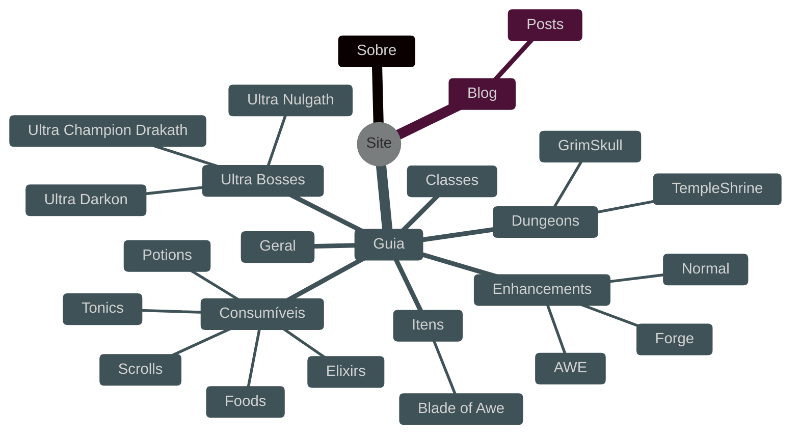

---
title: Início
icon:
authors:
  - pen
date: 2025-04-06
tags:
#  - sobre
keywords:
    - aqworlds
    - ultra
    - tutorial
    - dungeon
    - hardfarm
    - ultra boss
    - tonic
    - elixir
    - aqw tutorial
    - scroll
    - potion
    - como farmar gold no aqw
description: Aqui você vai encontrar diversos tutoriais, dicas, *walkthroughs* de um player *tryhard* do Adventure Quest Worlds, sobre aprimoramentos (enhancements), consumíveis (potions, elixirs, tonics, foods), como derrotar Ultra Bosses e mais.
social_share: true
hide:
  - toc
  - navigation
---

!!! tip inline end
    Veja os links à esquerda da página ou clique em :fontawesome-solid-bars: (canto superior esquerdo).
# Boas vindas!
---
Neste site, você vai encontrar diversos tutoriais, dicas, *walkthroughs* de um player *tryhard* do Adventure Quest Worlds.

Você poderá estar contribuindo para este guia de bolso no [Github](https://github.com/jix-AQW/site) ou entrando no nosso [Discord](https://discord.gg/uc9y27NYTp) e fazendo uma sugestão.

