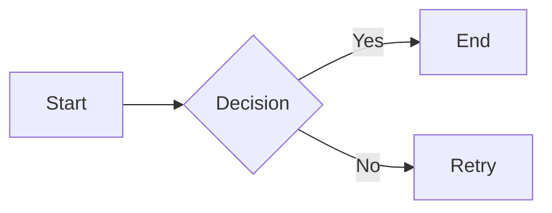

---
date:
  created: 2020-03-05
  updated: 2025-03-05
authors:
  - pen
categories:
  - Novidade
tags:
  - mkdocs
  - style
readtime: 
pin: true
thumbnail: https://marketplace.canva.com/EAFf5rfnPgA/1/0/800w/canva-blue-modern-eye-catching-vlog-youtube-thumbnail-XTJTyike0CE.jpg
excerpt: A experiência de participar QA e Tradutor de uma game jam para jogos de NES.
social_share: true
related_posts:
  - 20250305-ost-jam.md
draft: true
show: false
---
# Exemplo de Formatação de Texto

## Formatação Básica
- **Negrito**: `**texto**` ou `__texto__`
- *Itálico*: `*texto*` ou `_texto_`
- ~~Tachado~~: `~~texto~~`
- `Código inline`: `` `texto` ``
- :material-heart: Ícone Material: `:material-heart:`
- H~2~O (Subscrito): `H~2~O`
- 19^th^ (Sobrescrito): `19^th^`
- ++Inserido++: `++texto++`
- ==Marcado==: `==texto==` (requer extensão)
- [Texto abreviado]{.abbr title="Abbreviation"} `[Texto abreviado]{.abbr title="Abbreviation"}`

<!-- Ícones Material -->
[:material-rocket-launch:](#){ .md-icon }

## Blocos Especiais

### Admonitions
!!! note "Nota Importante"
    Exemplo de bloco de nota com `code inline`

!!! abstract "Resumo"
    Bloco abstract

!!! info ""
    Bloco info sem título

!!! tip "Dica"
    * Lista com
    * Marcadores

!!! danger "Perigo!"
    Texto em bloco de perigo

### Annotate
!!! annotate "Citação Destacada"

    "Lorem ipsum dolor sit amet" (1)

    1.  :material-comment-arrow-right: Esta é uma anotação explicativa que
        pode conter **formatação** e [links](#)

#### Detalhes Expansíveis
???+ note "Modo Básico"
    `???+` cria um bloco expandido por padrão
    
    ```python
    print("Detalhes expandíveis")
    ```

??? tip "Clique para Revelar"
    `???` padrão começa fechado
    
    - Funciona com qualquer tipo de admonition
    - Suporta conteúdo aninhado
    - **Markdown completo** dentro do bloco

??? quote "Citação com Fonte"
    "Texto da citação"
    — <cite>Autor, Obra</cite>

!!! critical "Urgente!"
    | Campo | Valor | |
    |--------------|-----------------|
    | Prioridade | Alta |
    | Sistema | Produção |


### Blocos de Código
```python title="exemplo.py"
def hello():
    print("Hello World!")
    // Comentário com highlight
    function test() {
        console.log("Hello from JS");
}
```


### Tabs

=== "CSS"
    ```css
    .classe {
        color: red;
    }
    ```

===+ "Configuração"
    ```yaml
    theme:
        features:
            - content.tabs.link
    ```

### Grid Layout
<div class="grid" markdown>

```python title="grid_left.py"
# Bloco esquerdo
def left():
    return "Grid left"

# Bloco direito
def right():
    return "Grid right"
```

```python title="grid_left.py"
# Bloco esquerdo
def left():
    return "Grid left"

# Bloco direito
def right():
    return "Grid right"
```
</div>

## Elementos Avançados

### Diagramas Mermaid


### Atalhos Teclado

```
Pressione ++ctrl+alt+d++ para reiniciar
```
Pressione ++ctrl+alt+d++ para reiniciar

### Tabela lida de Arquivo
{{ read_csv('assets/table-ultra-dage-comp-1.csv') }}
